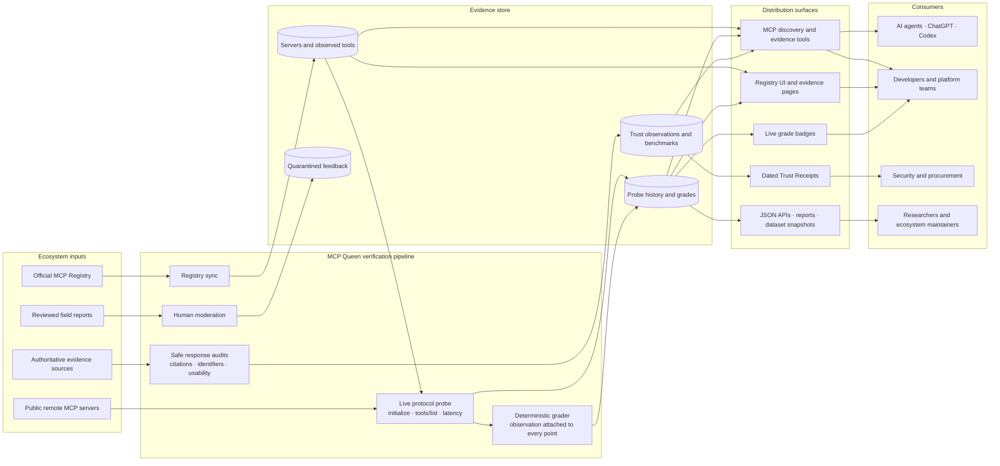

# MCP Queen architecture

> **Don't connect your AI agent to a stranger. Verify it first.**
>
> Find MCP servers quickly, inspect live evidence, then decide what to connect.

MCP Queen is an evidence and discovery layer for the MCP ecosystem. It does not
certify that a server is universally safe. It publishes dated, reproducible
observations so developers, agents, security teams, and procurement reviewers
can make a better-informed connection decision.

The repository-ready public version of this explanation is served at
`/architecture`. Its metadata, structured data, internal links, sitemap entry,
and `llms.txt` reference are validated by `npm run discovery:check`.

## Trust boundaries

### Public ecosystem inputs are untrusted

Registry metadata, public endpoint responses, repository links, and submitted
field reports are inputs, not endorsements. Registry and protocol observations
are stored with their source and observation time. Feedback remains
quarantined until human review.

### Probing is bounded observation

The grader makes bounded public protocol requests such as `initialize` and
`tools/list`. It does not bypass authentication or infer private behavior.
Auth-gated dimensions remain provisional when they cannot be observed.

### Operational grades and Trust Receipts are separate

The operational grade summarizes reachability, protocol behavior, observed
tool metadata, latency, and provenance. Trust Receipt dimensions record
separate security/access, data-integrity, citation, claim, response-benchmark,
and reviewed field evidence. Neither surface converts missing evidence into a
pass.

### MCP Queen is not the selected server's proxy

Discovery tools return a server's published endpoint and the evidence available
for review. The developer or agent makes a separate authorization decision and
connects directly to that server. MCP Queen is not in the selected server's
application-data path.

### Public and operator capabilities are separate

The public MCP surface exposes six read-only discovery/evidence tools and one
additive feedback tool. `submit_feedback` writes only to a quarantined review
queue. Key-gated maintenance routes are not MCP tools and are outside the
public discovery surface.

## The decision loop

1. **Find** servers and tools that match a real task.
2. **Verify** reachability, protocol behavior, tooling, latency, provenance,
   and any available trust evidence.
3. **Connect** only after reviewing the evidence and caveats.
4. **Report** operational experience for human review.
5. **Re-verify** continuously as servers and repositories change.

## What the grade means

The MCP Queen grade measures observable operational quality: reachability,
protocol support, tool metadata, latency, and provenance. Auth-gated dimensions
are marked provisional when they cannot be tested. Trust Receipts remain
separate from the grade and publish dated security/access, data-integrity,
citation, claim-verification, response-benchmark, and reviewed field evidence.

This separation is deliberate: an operational grade is not a security
certification, and missing evidence is not a pass.
