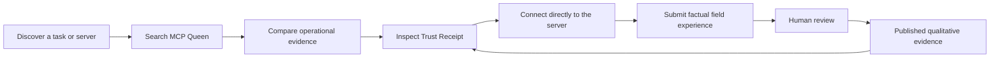

# MCP Queen distribution strategy

## Strategic objective

Make MCP Queen the evidence layer developers consult between discovering an MCP
server and connecting an agent to it.

The strategy is not “be listed everywhere.” It is:

1. make discovery fast;
2. make evidence legible;
3. make connection easy;
4. make the limitations impossible to miss;
5. make every integration create a measurable path back to evidence.

## Efficiency constraint

Distribution must consume less operator time than it creates in durable product
value.

- Keep one directory submission and one supporting content asset in active
  production at a time.
- Batch manual portal, identity, device-recording, and legal steps into one
  review session.
- Generate channel copy, tests, diagrams, captions, metadata, and status from
  canonical machine-readable sources.
- Reuse one verified artifact across multiple channels before producing a new
  one.
- Hold any channel that cannot produce a measurable developer path.
- Target less than one hour of manual operator work per weekly maintenance
  cycle; automation handles audits, validation, monitoring, and preparation.

## Positioning

Primary message:

**Don't connect your AI agent to a stranger. Verify it first.**

Category:

**Evidence and discovery infrastructure for the MCP ecosystem.**

Comparable mental models:

- SSL Labs for observable configuration evidence
- VirusTotal for multi-signal inspection
- Shodan for ecosystem discovery

The comparison explains the role, not equivalence of coverage. MCP Queen does
not certify security and must never imply that an operational grade proves
safety.

## Audiences and jobs

### Developers and agent builders

Job: find a server or tool for a real task, inspect current evidence, connect
with minimal setup, and avoid obviously dead or misleading options.

Primary path:

`search → compare → Trust Receipt → connection snippet`

### MCP server maintainers

Job: understand what an external probe observes, fix operational problems, and
show a live evidence badge.

Primary path:

`evidence page → finding → fix → re-probe → badge`

### Platform, security, and procurement teams

Job: separate observed protocol behavior from security, provenance, data,
citation, and claim evidence before allowing a connector.

Primary path:

`inventory → Trust Receipt → limitations → review decision`

### Researchers and ecosystem maintainers

Job: understand ecosystem health, stale repositories, tool coverage, protocol
behavior, and evidence gaps.

Primary path:

`dataset/API → methodology → reproducible analysis`

## Product funnel

MCP Queen is not a proxy in the connection path. The developer connects
directly to the selected server after reviewing evidence.

## Channel priorities

### Tier 0 — canonical trust and readiness

These surfaces must remain correct before any campaign:

- production MCP endpoint;
- official MCP Registry entry;
- GitHub repository, license, examples, and release metadata;
- website, evidence pages, policies, support, sitemap, and `llms.txt`;
- accurate schemas, tool annotations, architecture, and methodology;
- machine-readable distribution manifest and repeatable validation.

### Tier 1 — directory distribution

1. **OpenAI Plugins Directory**
   - Highest priority because it creates direct ChatGPT and Codex discovery.
   - Complete the current MCP-only submission.
   - Measure installs, queries, evidence-page referrals, and qualified feedback.

2. **Anthropic Connectors Directory**
   - Reuse verified endpoint facts, not OpenAI portal language.
   - The machine-readable package and reviewer materials were re-verified
     against Anthropic's public connector guidance on 2026-07-29.
   - Keep the channel blocked until `Origin` validation is live, all tools pass
     MCP Inspector and Claude custom-connector tests, Anthropic confirms how
     its test-credentials requirement applies to this authless service, and the
     account owner completes the current authority, policy, and portal checks.

3. **Official MCP Registry and Glama**
   - Maintain health and metadata.
   - Treat third-party scores as channel signals, not MCP Queen's source of
     truth.

### Tier 2 — developer implementation paths

- GitHub quickstarts and examples
- LangChain
- LlamaIndex
- Cloudflare Agents
- Hugging Face Inference Providers and a dataset card only after the dataset
  has a verified Hub URL

Each example must run, use the canonical endpoint, default automatic model
access to read-only tools, and link back to the evidence methodology.

The audited compatibility and channel-value decisions are recorded in
[`developer-ecosystem.md`](developer-ecosystem.md). Native model-free clients
come first; framework assets remain examples rather than implied listings.

### Tier 3 — discoverability and authority

- Canonical integrations page
- Architecture and methodology pages
- Search-oriented setup pages only where intent is distinct
- Demo video with transcript, chapters, and `VideoObject` schema
- Evidence reports on dead repositories, grade movement, and ecosystem gaps
- Technical launch/case-study publication after directory links are real

### Tier 4 — selective marketplaces

RapidAPI is optional. Publish there only if the companion REST API serves a
distinct audience, produces qualified demand, or supports a deliberate
commercial path. Do not duplicate an MCP listing simply to complete a matrix.

## Content system

One core artifact should produce several surfaces:

| Source artifact | Reusable outputs |
|---|---|
| OpenAI demo | Reviewer URL, public video, transcript, chapters, clips, FAQ, setup article |
| Architecture | README diagram, integrations page, conference slide, procurement explainer |
| Probe data | Ecosystem report, dead-repository report, grade-change digest, research dataset |
| Trust Receipt | Product example, reviewer test, security/procurement explainer |
| Badge outreach | Maintainer feedback, adoption case study, documentation improvements |

## Video strategy

The submission recording is a compliance deliverable first and a distribution
asset second.

After review:

1. remove any reviewer-only framing;
2. publish a clean public version;
3. host or embed it on an `/openai-demo` or equivalent canonical page;
4. add an accessible transcript and chapters;
5. add `VideoObject` structured data;
6. cut short clips for discovery, evidence, field reports, and guardrails;
7. link every clip to the relevant product or evidence page.

## Measurement

### North-star signal

Developers who inspect evidence and continue to a real connection path.

### Leading indicators

- MCP tool calls from non-bot clients
- evidence-page and integration-page referrals
- connection-snippet and referral-link use
- plugin/directory installs and listing traffic
- GitHub example engagement and qualified issues
- badge embeds, replies, and resolved findings
- Trust Receipt views and evidence searches
- reviewed real-usage field reports
- Hugging Face downloads and citations
- qualified platform, security, or developer inbound

### Guardrail indicators

- disputes caused by unclear grade meaning;
- stale probe or repository metadata;
- fabricated or low-specificity feedback attempts;
- broken examples or directory metadata drift;
- traffic without evidence engagement or connection intent.

## Experiment cadence

For each channel:

1. record a baseline;
2. publish one complete, measurable integration;
3. observe at 7, 14, and 42 days;
4. improve the path once if evidence identifies a clear friction point;
5. maintain, expand, or stop based on qualified signals.

Do not interpret raw impressions as adoption. Prefer connection activity,
evidence use, badge adoption, developer questions, or qualified inbound.

## Immediate execution sequence

1. Finish the OpenAI portal draft through Prompts, Testing, and Global.
2. Record the prepared 5:35 cross-platform demo and host the reviewer URL.
3. Complete domain verification, identity selection, final review, and submit.
4. Monitor the submission; do not start a second major directory form during
   the recording/review push.
5. Close the Anthropic `Origin`-validation blocker through the product and
   deployment lanes, then complete the manual Claude, account, policy, and
   portal checks from the prepared package.
6. Promote the prepared native/framework examples and correct Hugging Face
   dataset card in the next curated repository release; publish the Hub dataset
   only after its repository, license treatment, files, and URL are verified.
7. Publish the cleaned demo, transcript, chapters, and structured data after
   the reviewer asset exists.
8. Measure OpenAI, GitHub examples, field-report engagement, badge outreach,
   and Hugging Face signals at 7, 14, and 42 days.
9. Publish one evidence-led ecosystem report using observed data.
10. Decide whether to expand Clarity based on qualified adoption signals.
11. Keep RapidAPI on hold unless a distinct REST audience becomes visible.

## Portfolio rollout

### Phase 1 — MCP Queen

Complete OpenAI submission and demo; maintain the prepared Anthropic package
until its technical and manual gates close; continue badge monitoring,
measurement, and one evidence-led publication.

### Phase 2 — Clarity

Position as a developer capability for wellness, fitness, tracker, and
health-oriented applications. Rebuild the test cases and policies around
Clarity's actual data, API, and safety boundaries. Reuse the distribution
system, not MCP Queen's trust claims.

### Phase 3 — Constat

Position around evidence, citation, or claim-verification workflows supported
by the actual server. Rebuild the submission and examples around its tools.

### Expansion gate

Advance the full template to the next product after MCP Queen produces at least
one meaningful signal:

- directory approval;
- repeated developer tool use;
- badge adoption;
- qualified integration interest;
- measurable evidence/referral growth;
- dataset use or citation.

Preparation may proceed earlier, but publication effort should stay
prioritized.

## Decisions that remain manual

- new/nonstandard legal contracts or unsupported attestations;
- publisher identity and account permissions;
- production database/methodology changes;
- moderation of field reports;
- new outreach audiences or material messaging changes;
- paid distribution or marketplace monetization above the recorded standing
  cap;
- CAPTCHA, 2FA, hardware-key, or device-confirmation challenges.

Everything around those decisions should be prepared in advance so the manual
action is small and reviewable.
